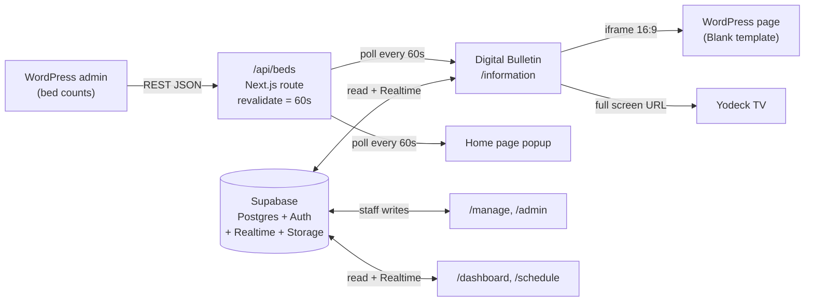

# SMCS Digital Bulletin & Website


## Overview

This is the Next.js web application for **Saint Mary's Community Services
(SMCS)**, a nonprofit shelter. Its centerpiece is the **Digital Bulletin**: a
full-screen, auto-rotating information display built for wall-mounted TVs
around the campus. Screens run [Yodeck](https://www.yodeck.com/) pointed at the
`/information` route; the same route is embedded in an iframe on the SMCS
WordPress site and previewed on this app's own home page.

The bulletin rotates through a mix of built-in pages (weekly services, new
arrivals, a featured demographic page, events happening today) and custom
slides that staff create themselves. A live **bed availability** panel is
pinned to the top-right corner of every slide, and everything staff can change
is edited through the **management interface** at `/manage`.

The repository is not only the bulletin. The same Next.js app also serves:

| Route          | What it is                                                          |
| -------------- | ------------------------------------------------------------------- |
| `/`            | Public marketing home page (hero, live bulletin preview, bed popup)  |
| `/information` | **Digital Bulletin**: the wall display / Yodeck / iframe target      |
| `/dashboard`   | Live Calendar: public, view-only week schedule for TVs and phones    |
| `/schedule`    | A signed-in user's personal schedule                                 |
| `/manage`      | Staff editor: events, bulletin content, custom slides, locations     |
| `/admin`       | Admin-only user and role management                                  |
| `/login`, `/signup` | Staff authentication (`@smcares.org` addresses only)            |

The site is bilingual (English / Spanish) via a locale cookie, and the bulletin
renders both languages together since an unattended wall display has nobody to
operate a language chooser.

> **TODO: verify.** The prompt that produced this README described the repo as
> a bulletin-only project. It is actually the full SMCS website plus the
> bulletin. Confirm whether the bulletin is meant to be split into its own
> deployment, or whether one app serving all routes is the intended shape.

## Architecture

### The larger ecosystem

**Supabase is the single source of truth.** All bulletin content, custom
slides, events, user profiles/roles, and display settings live in Supabase
Postgres, protected by Row Level Security. This web app reads and writes it
directly from the browser using the public anon key. RLS, not key secrecy, is
the authorization boundary.

**WordPress is a secondary data source, for bed counts only.** SMCS staff
update bed availability inside WordPress admin; this app reads those numbers
through a single server-side API route and never writes back.

> **TODO: verify.** A React Native mobile app is said to share this Supabase
> backend. There is no mobile app code in this repository and nothing in the
> code references one. Confirm the app exists, where it lives, and whether any
> schema in `supabase/migrations/` is shared with it before changing tables.



### The fixed 1920×1080 canvas

This is the single most important design decision in the bulletin, and the one
most likely to be broken accidentally.

Every slide is laid out on a **fixed 1920×1080 canvas**
(`src/lib/bulletinCanvas.ts`). `InformationDisplay` measures the box it was
handed (not the window) with a **`ResizeObserver`**, computes the largest
whole-canvas scale that fits (`fitScale`, a "contain" fit that letterboxes
rather than crops), and applies it as a single CSS `transform: scale()`. The
letterbox bars are filled with the current slide's own background color so an
odd-shaped container still reads as one field of color.

A `ResizeObserver` is used instead of a `window.resize` listener specifically so
the display also tracks an iframe or a Yodeck region that changes size without
the window changing.

**Consequence for anything you render inside a slide:** size against the
*canvas*, never the viewport.

- Use container queries (`@min-[40rem]:`, `@min-[64rem]:`) instead of Tailwind
  viewport breakpoints (`sm:`, `lg:`).
- Use `cqw` / `cqh` instead of `vw` / `vh`.

Inside an iframe the viewport *is* the iframe's own box, so a viewport unit or
media query in a slide makes the embedded bulletin silently fall into a
phone-sized layout. That bug is exactly what the canvas exists to prevent.

### The WordPress iframe embed

`/information` renders with no site header, never scrolls, and fills its box
exactly, so it can be embedded as-is. The embed is a **16:9 iframe on a
WordPress page using the Blank template** (no theme chrome).
`BulletinPreviewCard` on this app's home page does the same thing locally and is
a good reference for the markup:

```html
<div style="position:relative;width:100%;aspect-ratio:16/9;">
  <iframe
    src="https://<your-vercel-domain>/information?location=<slug>"
    style="position:absolute;inset:0;width:100%;height:100%;border:0;"
    scrolling="no"
    title="SMCS Digital Bulletin"
  ></iframe>
</div>
```

> **TODO: verify.** The WordPress side (which page, which plugin/block holds
> the iframe, who has admin access) is not represented in this repository. Get
> the page URL and credentials documented before the handoff.

## Tech Stack

Versions are the ranges declared in `package.json`; the exact installed
versions are pinned in `package-lock.json`.

| Package                        | Version   | Role                                      |
| ------------------------------ | --------- | ----------------------------------------- |
| `next`                         | ^15.5.19  | App Router, server components, API routes |
| `react` / `react-dom`          | 19.1.0    | UI runtime (exact pin, no caret)          |
| `typescript`                   | ^5        | Strict TypeScript                         |
| `tailwindcss` / `@tailwindcss/postcss` | ^4 | Styling and design tokens                |
| `@supabase/supabase-js`        | ^2.108.2  | Database, Auth, Realtime, Storage client  |
| `@supabase/ssr`                | ^0.12.0   | Cookie-based Supabase session for SSR/middleware |
| `next-intl`                    | ^4.13.2   | English/Spanish messages, cookie-based locale |
| `framer-motion`                | ^12.42.2  | Slide transitions on the bulletin         |
| `lucide-react`                 | ^1.23.0   | Icon set                                  |
| `@fullcalendar/*`              | ^6.1.21   | Week calendars (core, daygrid, timegrid, list, interaction, react) |
| `eslint` / `eslint-config-next` | ^9 / ^15.5.19 | Linting                              |

There is **no test framework** in this project. `npm run build` is the only
type/lint gate.

## Prerequisites

- **Node.js**: no version is pinned in `package.json`. Development is done on
  Node 22.x, which is what you should use. Next.js 15 requires Node 18.18+.
- **npm**: the repo commits `package-lock.json`, so use npm (`npm ci`), not
  yarn or pnpm.
- **A Supabase project**: with the migrations in `supabase/migrations/`
  applied. Ask an existing maintainer for access to the production project
  rather than creating a new one.
- **A Vercel account** with access to the SMCS project (for deploys).
- **Yodeck access**: to point the physical TVs at the bulletin URLs.
- **WordPress admin access** on the SMCS site, to update bed counts and to
  edit the page holding the bulletin iframe.

## Environment Variables

Copy the names from `.env.example` into a local `.env.local`. **Never commit
`.env.local`** (it is gitignored) and never print its values.

| Variable                        | Public? | What it does | Where to get it |
| ------------------------------- | ------- | ------------ | --------------- |
| `NEXT_PUBLIC_SUPABASE_URL`      | Public (browser) | Supabase project URL, e.g. `https://<ref>.supabase.co`. Used by the browser client, the server client, and middleware. | Supabase → Settings → API → "Project URL" |
| `NEXT_PUBLIC_SUPABASE_ANON_KEY` | Public (browser) | Supabase publishable/anon key. Safe to expose; access is restricted by RLS, not by hiding this key. | Supabase → Settings → API → "Publishable key" (or the legacy "anon" key) |
| `BED_DATA_URL`                  | **Server-only** | Full URL of the WordPress REST endpoint returning live bed availability JSON. Read only inside `/api/beds`, so it never reaches the browser. | The SMCS WordPress site (ask whoever maintains the bed-count plugin/endpoint) |

Notes:

- `.env.local` is read by Next.js **at startup only**, so restart the dev server
  after editing it.
- `src/lib/supabase.ts` throws a descriptive error at import time if either
  `NEXT_PUBLIC_*` variable is missing, so a misconfigured environment fails
  loudly rather than silently.
- **Never** put a Supabase `service_role` / secret key in any `NEXT_PUBLIC_*`
  variable. It bypasses RLS entirely and would be shipped to every browser.
- `.env.example` lists all three required names with no values, and is the
  template to copy. The `DATABASE_URL` it mentions is commented out and is
  **not** read anywhere in the code today.

Example `.env.local` (placeholders only):

```dotenv
NEXT_PUBLIC_SUPABASE_URL=https://your-project-ref.supabase.co
NEXT_PUBLIC_SUPABASE_ANON_KEY=sb_publishable_xxxxxxxxxxxxxxxxxxxxx
BED_DATA_URL=https://smcares.org/wp-json/<namespace>/<route>
```

## Local Setup

```bash
# 1. Clone
git clone https://github.com/nickaustinn/SMSC-App-Digital-Schedule.git
cd SMSC-App-Digital-Schedule

# 2. Install exactly what the lockfile specifies
npm ci

# 3. Create your local environment file and fill in real values
cp .env.example .env.local
$EDITOR .env.local   # add NEXT_PUBLIC_SUPABASE_URL, NEXT_PUBLIC_SUPABASE_ANON_KEY, BED_DATA_URL

# 4. Run
npm run dev
```

Then open:

- <http://localhost:3000>: home page
- <http://localhost:3000/information>: the Digital Bulletin
- <http://localhost:3000/information?location=dining-room>: a location-targeted bulletin
- <http://localhost:3000/bed-test>: the bed panel in isolation

Verification commands:

```bash
npm run lint    # Next.js ESLint (note: `next lint` is deprecated in a future major)
npm run build   # production build; this is also the type-check
npm run start   # serve an existing production build
```

Do not run `npm run build` while `npm run dev` is running against the same
`.next` directory.

**Database setup.** The web deploy and the database are separate. Apply
`supabase/migrations/*.sql` **in numeric order** via the Supabase SQL Editor
(each file's header comment says so). Migration `0008` creates the public
`slide-images` Storage bucket and its staff-write policies. Migration `0011` is
superseded by `0020`, so do not re-run `0011` after `0020`. Add new schema
changes as new, ordered, idempotent migration files; never rewrite applied ones.

## Project Structure

```
.
├── messages/
│   ├── en.json                      # English UI strings (next-intl)
│   └── es.json                      # Spanish UI strings
├── supabase/migrations/             # Ordered SQL, the database source of truth
├── public/                          # Checked-in site images (hero.avif, etc.)
├── docs/                            # Screenshots + Supabase confirmation-email template
├── next.config.ts                   # Next config; wires the next-intl plugin
├── AGENTS.md                        # Conventions + working rules for coding agents
└── src/
    ├── middleware.ts                # Auth gate for /schedule, /manage, /admin; refreshes session cookie
    ├── i18n/
    │   ├── config.ts                # Locales, default, SMCS_LOCALE cookie name
    │   └── request.ts               # Per-request locale + message loading
    ├── app/
    │   ├── layout.tsx               # Root layout: html/body, globals.css, NextIntlClientProvider
    │   ├── globals.css              # Tailwind import, design tokens, a11y base rules, FullCalendar theming
    │   ├── (site)/                  # Route group WITH site chrome (Header + NavBar + Footer)
    │   │   ├── layout.tsx
    │   │   ├── page.tsx             # Home: hero, bulletin preview iframe, bed popup
    │   │   ├── schedule/page.tsx    # Personal calendar (auth required)
    │   │   ├── manage/page.tsx      # Staff editor (employee/admin only)
    │   │   ├── login/page.tsx
    │   │   └── signup/page.tsx      # Staff sign-up, @smcares.org only
    │   ├── information/page.tsx     # DIGITAL BULLETIN: full-screen, no chrome, reads ?location=
    │   ├── dashboard/page.tsx       # Live Calendar wall display
    │   ├── admin/page.tsx           # Admin user/role manager
    │   ├── bed-test/page.tsx        # Scratch page: bed panel on its own
    │   └── api/beds/route.ts        # GET bed availability, proxied from WordPress
    ├── components/
    │   ├── information/             # Bulletin slides and shell
    │   │   ├── InformationDisplay.tsx   # Rotation controller + canvas scaling. The heart of the bulletin.
    │   │   ├── InfoPageShell.tsx        # Shared slide frame (header band, background)
    │   │   ├── ServicesOverviewPage.tsx # "This Week's Services" (repeatable, numbered)
    │   │   ├── NewArrivalsPage.tsx      # New arrivals slide
    │   │   ├── DemographicPage.tsx      # Featured-group slide (currently pregnant women)
    │   │   ├── EventsTodayPage.tsx      # Live "events happening today" from the events table
    │   │   ├── CustomSlidePage.tsx      # Renders a staff-authored slide
    │   │   ├── SlideTemplateView.tsx    # The four slide layout templates
    │   │   ├── ExpandableServiceCard.tsx
    │   │   ├── RotatingLeaf.tsx, InfoEyebrow.tsx
    │   │   └── motion.ts                # Shared Framer Motion variants
    │   ├── manage/                  # Staff editors: slides, info content, events, locations
    │   ├── admin/                   # Admin sidebar + user manager
    │   ├── dashboard/               # Live Calendar: info bar, calendar, QR placeholder
    │   ├── calendar/                # Shared week calendar + event modal
    │   ├── schedule/                # Personal calendar wrapper
    │   ├── auth/                    # Login / sign-up forms, auth nav
    │   ├── BedAvailabilitySlide.tsx # Red bed panel pinned on the bulletin canvas
    │   ├── BedAvailabilityPopup.tsx # Taller bed panel for the home page
    │   ├── BulletinPreviewCard.tsx  # Home-page 16:9 iframe of /information
    │   └── Header/NavBar/Footer/... # Site chrome
    └── lib/
        ├── bulletinCanvas.ts        # CANVAS_WIDTH/HEIGHT, canvasStyle, fitScale()
        ├── slides.ts                # Custom-slide types, CRUD, ordering, image upload
        ├── infoContent.ts           # Editable bulletin content stored in Supabase (+ icon map)
        ├── informationContent.ts    # Default/fallback copy and PAGE_DURATION
        ├── displaySettings.ts       # Which built-in slides are hidden
        ├── bulletinLocations.ts     # Locations + per-page/per-slide location targeting
        ├── useBedAvailability.ts    # Client hook polling /api/beds (shared by both bed panels)
        ├── events.ts / manageEvents.ts / useLiveEvents.ts  # Event reads, writes, Realtime
        ├── supabase.ts              # Browser client (cookie session via @supabase/ssr)
        ├── supabase-server.ts       # Server client for Server Components / route handlers
        ├── adminUsers.ts            # Admin RPC wrappers for listing users and setting roles
        ├── staffSignup.ts           # STAFF_EMAIL_DOMAIN ("smcares.org") + check
        ├── dashboardConfig.ts       # Live Calendar hours, info-bar items
        ├── siteConfig.ts, siteNavigation.ts, eventColors.ts
        └── README.md                # Guide to this folder, grouped by concern
```

## Key Features

### Bed availability, end to end

This is the one feature that crosses system boundaries, so here is the full
path:

1. **Staff update the count in WordPress admin.** WordPress exposes the current
   numbers at a REST endpoint.
2. **`GET /api/beds`** (`src/app/api/beds/route.ts`) fetches `BED_DATA_URL`
   server-side with `next: { revalidate: 60 }` and `export const revalidate = 60`,
   so Next.js caches the upstream response for **60 seconds**. On any failure it
   logs and returns `{ ok: false }` with HTTP 200. That is deliberate, so the
   client treats it as "no new data" rather than an error.
3. **`useBedAvailability()`** (`src/lib/useBedAvailability.ts`) fetches
   `/api/beds` on mount and then **every 60 seconds**. It ignores responses with
   `ok: false`, so a failed poll keeps the last good numbers on screen instead of
   blanking the display. It returns `null` until the first success.
4. **The panel renders.** `BedAvailabilitySlide` shows white-on-red counts in the
   bulletin's top-right corner; `BedAvailabilityPopup` shows a taller version on
   the home page, dismissible for the browser session only.

Because there are two 60-second layers (route cache + client poll), a change in
WordPress appears on the display **within roughly 60 seconds, and at worst
around two minutes**. `BedAvailabilitySlide` renders nothing at all when no
program data has loaded; the display never shows a number it is not sure of.

The panel's position is a contract with the slides: `BED_PANEL_CLEARANCE` in
`BedAvailabilitySlide.tsx` is a `min-height` each slide applies to its header
band so slide content always starts below the panel. **If you change the panel's
width, padding, or type size, re-measure it and update that constant**, or
slides will start creeping underneath it.

The red (`#c1121f`) is a deliberate exception to the two-color palette: it marks
a live-status callout on an otherwise paper-white bulletin.

### Slide rotation

`InformationDisplay` builds the rotation in a fixed order:

1. Every non-empty "This Week's Services" page (repeatable and auto-numbered
   "Page N of M"),
2. New arrivals,
3. The featured demographic page,
4. Events happening today,
5. Then all staff-created custom slides, ordered by their `position`.

Each page is shown for `PAGE_DURATION` (**30 seconds**, in
`src/lib/informationContent.ts`), then advances with a 0.5s cross-fade. Exactly
one slide is mounted at a time (`AnimatePresence mode="wait"`), so the DOM holds
a single slide that always covers the canvas exactly. Clickable dots at the
bottom let someone jump to a page manually; their color tone adapts to the
current slide's background so they stay visible.

Two filters apply on top of that order:

- **Hidden built-ins**: staff can remove a built-in page from the rotation
  without losing its editor (`display_settings.hidden_builtins`). Services, new
  arrivals, and events-today are protected and cannot be hidden.
- **Location targeting**: with `?location=<slug>`, a page or slide appears only
  if it has no location rows (meaning "all locations") or if it explicitly
  targets that location.

Content, slides, hidden settings, and location targeting are all loaded from
Supabase and kept live via a Realtime channel subscribed to `info_content`,
`slides`, `slide_locations`, `builtin_page_locations`, `bulletin_locations`, and
`display_settings`. **A staff edit reaches the TVs without anyone touching the
TVs.**

### Management interface (`/manage`)

Staff (role `employee` or `admin`) get a sticky sidebar over three sections:

- **Calendar**: create, drag, resize, and delete events; a quick-add form
  writes to the same `events` table that feeds the Live Calendar and the
  "Events today" bulletin slide.
- **Digital Bulletin pages**: edit the built-in pages' copy (English and
  Spanish), hide/restore built-ins, and assign pages to locations.
- **Custom slides**: pick one of four templates (`title-body`,
  `title-image-text`, `image-focus`, `title-list`), pick a background
  (blue/teal/white), enter English and Spanish text, upload an image to the
  `slide-images` Storage bucket, reorder by drag, and target locations.
- **Bulletin locations**: add screens and copy the exact
  `/information?location=<slug>` URL to paste into Yodeck.

Deletions are recoverable: hidden built-ins and soft-deleted custom slides
(`slides.hidden = true`) appear under "Recently deleted" with a Restore action.

Access control is layered: middleware requires a session, the page re-checks the
role server-side, and **RLS in Postgres is the actual enforcement**. UI guards
are convenience, never the boundary.

## API Routes

There is exactly one API route in this application.

### `GET /api/beds`

- **File:** `src/app/api/beds/route.ts`
- **Method:** `GET` (no parameters)
- **Behavior:** server-side fetch of `process.env.BED_DATA_URL`, spread into the
  response envelope.
- **Revalidation:** `export const revalidate = 60` plus `next: { revalidate: 60 }`
  on the fetch, so the upstream WordPress response is cached for 60 seconds.
- **Success:** `200` with `{ ok: true, ...upstreamJson }`:

  ```json
  {
    "ok": true,
    "programs": [
      {
        "key": "family",
        "label": "Family Shelter",
        "counts": { "male": { "label": "Male beds available", "count": 4 } },
        "total": 4
      }
    ],
    "reserve_phone": "(209) 555-0123",
    "updated_at_display": "Updated 9:15 AM"
  }
  ```

  > **TODO: verify.** The exact upstream field names and program list above are
  > reconstructed from the `BedData` TypeScript type in
  > `src/lib/useBedAvailability.ts`. Confirm against a real response from the
  > WordPress endpoint.

- **Failure:** logs `Bed data fetch failed:` and returns **HTTP 200** with
  `{ ok: false }`. This is intentional: clients keep displaying the last known
  good counts instead of blanking or erroring.
- A program whose `total` is `0` is rendered as a "Full" badge rather than a
  zero.

All other data flows go directly from the browser to Supabase (through
`src/lib/*`), not through Next.js API routes.

## Deployment

This is a standard Next.js app. There is **no `vercel.json`** and no other
checked-in Vercel configuration, so do not assume custom regions, redirects, or
build settings exist.

1. Import the GitHub repository into Vercel. The framework preset is Next.js;
   build command `npm run build`, install command `npm ci`, output handled by
   the preset.
2. Add the environment variables in **Vercel → Project → Settings →
   Environment Variables**, for Production *and* Preview:
   - `NEXT_PUBLIC_SUPABASE_URL`
   - `NEXT_PUBLIC_SUPABASE_ANON_KEY`
   - `BED_DATA_URL`
3. Deploy, then smoke-test `/`, `/information`, `/dashboard`, `/manage`, and
   `/api/beds` on the deployment URL.

The database is deployed separately: apply `supabase/migrations/*.sql` in the
Supabase SQL Editor in numeric order (see [Local Setup](#local-setup)).

### Production handoff checklist

- [ ] All three environment variables set in Vercel (Production and Preview).
- [ ] Supabase migrations `0001`–`0020` applied to the production project, and
      the `slide-images` Storage bucket exists and is public.
- [ ] Supabase Auth: the site URL and redirect URLs point at the Vercel domain,
      and the confirmation-email template matches
      `docs/supabase-confirm-signup-email.html`.
- [ ] At least one `admin` profile exists (roles are set from `/admin`; the very
      first admin has to be promoted directly in Supabase).
- [ ] Update the **WordPress iframe `src`** to the Vercel URL (with the correct
      `?location=` slug if that page is for one screen).
- [ ] **Configure framing headers.** Next.js does not send `X-Frame-Options` by
      default, so framing currently works but is unrestricted. To allow the SMCS
      WordPress domain and nothing else, add headers in `next.config.ts`:

      ```ts
      const nextConfig: NextConfig = {
        async headers() {
          return [
            {
              source: "/information",
              headers: [
                {
                  key: "Content-Security-Policy",
                  value:
                    "frame-ancestors 'self' https://smcares.org https://www.smcares.org",
                },
              ],
            },
          ];
        },
      };
      ```

      Prefer CSP `frame-ancestors` over `X-Frame-Options`; the latter has no
      multi-origin form, and `SAMEORIGIN` would break the WordPress embed. If
      you add `X-Frame-Options` for older-browser coverage, scope it to the same
      `/information` source and make sure it does not contradict the CSP.

      > **TODO: verify.** Confirm the exact production WordPress origin(s)
      > (apex vs. `www`, http vs. https) before adding this, since a wrong value
      > silently blanks the embed.
- [ ] Yodeck players updated to the production URLs (below).
- [ ] Confirm the bulletin renders correctly at 1920×1080 on an actual TV, not
      just in a desktop browser.

## Yodeck / TV Display Setup

Each wall-mounted TV runs a Yodeck player showing a **Web Page** item pointed at
the bulletin:

```
https://<your-vercel-domain>/information?location=<slug>
```

- Set the Yodeck item to **full screen, 1920×1080, no scrollbars**, with
  refresh/reload off, since the page rotates and refreshes its own data
  indefinitely, so a scheduled reload is unnecessary.
- Omitting `?location=` shows **every** page and slide (all global plus all
  targeted content). Use a slug so a screen only shows what is meant for it.
- The exact per-location URL for each screen is displayed and copyable inside
  `/manage` → bulletin locations, which is the authoritative list.

Locations seeded by migration `0017`, with later renames applied in `0018` and
`0019`:

| Location                 | Slug                       |
| ------------------------ | -------------------------- |
| Family Shelter Cafeteria | `family-shelter-cafeteria` |
| Zeider Housing Lobby     | `zeider-housing-lobby`     |
| Dining Room              | `dining-room`              |
| Mens Hygiene             | `mens-hygiene`             |
| Womens Hygiene           | `womens-hygiene`           |
| Dentist Building         | `dentist-building`         |

> Renaming a location changes its slug, which changes its URL. Whoever renames
> it must re-point that screen in Yodeck. Check `/manage` for the current list
> before trusting this table.

## Maintenance & Troubleshooting

**Bed counts are not updating on the display.**
Check in order: (1) open `/api/beds` on the deployment, and if it returns
`{ ok: false }`, the upstream fetch failed, so check `BED_DATA_URL` is set in
Vercel and that the WordPress endpoint responds; (2) remember the two
60-second layers, so wait ~2 minutes before concluding anything is broken;
(3) if the panel is missing entirely rather than stale, `programs` was absent
from the response, so `BedAvailabilitySlide` returns `null` rather than render an
uncertain number.

**The bed panel covers slide content.**
The panel is pinned to the canvas at `right-5 top-5 w-[29rem]`, and slides
reserve room for it via `BED_PANEL_CLEARANCE`. If the panel's size changed,
re-measure the rendered height and update that constant in
`src/components/BedAvailabilitySlide.tsx`.

**The bulletin looks like a phone layout inside the WordPress iframe.**
Something inside a slide is keying off the viewport instead of the canvas. Grep
the slide for `vw`, `vh`, or Tailwind viewport breakpoints (`sm:`, `md:`,
`lg:`) and replace them with `cqw`/`cqh` and container queries
(`@min-[40rem]:`, `@min-[64rem]:`). See `src/lib/bulletinCanvas.ts`.

**The iframe renders blank or is refused.**
Open the WordPress page's browser console. `Refused to display … in a frame`
means a `frame-ancestors` / `X-Frame-Options` value does not include the
WordPress origin, so fix the header in `next.config.ts` (see the handoff
checklist). Also confirm the WordPress page uses the **Blank template**, and
that the iframe's container has a real height (a `16/9` aspect-ratio box, not
`height: auto`).

**The bulletin is letterboxed with colored bars.**
Expected: `fitScale` "contains" rather than crops so nothing is cut off. The
bars are painted with the current slide's background. If the container is not
16:9, either fix the container or accept the bars.

**Slides flash at full size on load.**
The canvas is hidden until `ResizeObserver` reports a measurement (`scale`
starts at `0`). If you see a flash, something is rendering the canvas outside
`InformationDisplay`'s scaling wrapper.

**A staff edit does not appear on the TVs.**
The display listens to Supabase Realtime. Confirm the edited table is in the
Realtime publication (the migrations set this up) and that the slide is not
`hidden`, is not location-targeted away from that screen, and (for services
pages) is not empty (empty services pages are filtered out before numbering).

**Sign-up is rejected.**
Only `@smcares.org` addresses can register. That is enforced both in
`src/lib/staffSignup.ts` and by a database trigger (migrations `0011`/`0020`),
so it cannot be bypassed via the auth API. A new account has **no** editing
access until an admin grants `employee` or `admin` from `/admin`.

**Local dev crashes at startup with "Missing Supabase env vars."**
`.env.local` is missing or was edited without restarting the dev server. Next.js
reads env only at startup.

**Times look off by a timezone.**
Calendar times intentionally use **UTC as a fixed wall clock**; FullCalendar is
configured with `timeZone="UTC"`. Do not introduce local-time conversion without
a product decision and a data migration plan.

## Constraints & Conventions

**Free-tier infrastructure only. This is a hard cost constraint.** SMCS is a
nonprofit and this project runs on free tiers (Vercel Hobby, Supabase free).
Do not introduce paid services, paid add-ons, or usage patterns that would push
past free-tier limits. Prefer polling intervals and caching that stay within
quota; the 60-second bed cache exists partly for this reason.

**Accessibility.** The audience is older and often in distress. WCAG AA contrast
is required for all text and UI. The base font size is set to `18px` in
`globals.css` with generous line height. Every interactive element keeps a
visible focus style, and clickable elements show a pointer cursor.

**Palette.** Teal (`#00aaa6`) and blue (`#0054a4`) are the *only* accent colors,
on white (`#ffffff`) with black (`#000000`) text; `#d4d4d4` is the neutral
placeholder gray. The bed panel's red (`#c1121f`) is the one deliberate
exception, for live status. **Do not change or extend the palette without
explicit instruction.** Use the Tailwind theme tokens (`blue`, `teal`, `ink`,
`paper`, `placeholder`) rather than raw hex values.

**Static, minimal motion.** Given the user population, the display is calm by
design: a 0.5s cross-fade between slides and gentle staggered rise-ins
(`src/components/information/motion.ts`). No flashing, no fast movement, no
attention-grabbing animation.

**Code conventions** (see `AGENTS.md` for the full list):

- Server Components are the default; add `"use client"` only for browser state,
  effects, Supabase browser calls, or interactive third-party UI.
- Use `@/` imports for anything under `src`. Keep data access in `src/lib`, not
  inline in pages or components.
- `createSupabaseServerClient()` for server-side auth/role checks; the shared
  browser `supabase` client for client queries and Realtime. Never put a
  service-role key in browser code.
- Preserve the middleware auth gate, page-level role redirects, **and** RLS.
  Route guards are not substitutes for RLS.
- Keep the `DashboardEvent` contract: DB rows are mapped snake_case → camelCase
  in `src/lib`; `WeekCalendar` stays presentational.
- Pair every Realtime subscription with its cleanup.
- Database changes go in new, ordered, idempotent migration files. Never rewrite
  applied migration history.

## Known Unfinished Work

- The Live Calendar's QR area is still `QrPlaceholder`; QR generation is not
  implemented.
- The Live Calendar's info bar (`INFO_BAR_ITEMS` in `dashboardConfig.ts`) and
  the header contact details (`siteConfig.ts`) are edited in code, not by
  staff. Both files hold the real SMCS phone and email, and they duplicate each
  other, so a change has to be made in both places. Making them staff-editable
  is the obvious next step.
- `informationContent.ts` is sample/fallback copy; staff overrides saved in
  Supabase take precedence.
- Client self-registration and a staff/admin path for assigning personal
  `signups` are not implemented; the database trigger currently allows only the
  staff email domain to create users.
