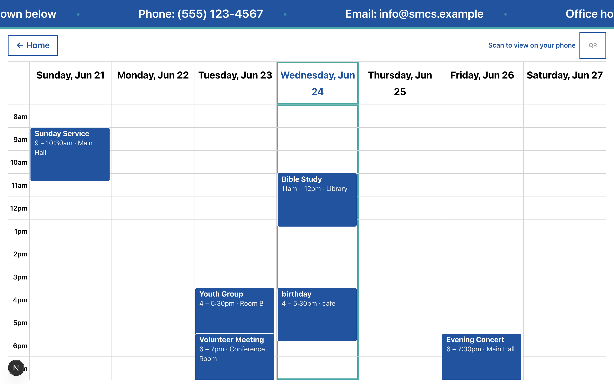

# Saint Mary's Care Services Website and App

Saint Mary's Care Services (SMCS) is a community care organization. This is its
public website and scheduling app. Built to make SMCS's services and schedules
clear, accessible, and always up to date.

The project brings together three views over a single, shared schedule:

- a **public website** and a **Live Calendar** designed to be read
  from across a room on wall-mounted TVs (and on phones via a QR code);
- **personal calendars**, where each client sees the services and
  appointments they're signed up for;
- a **staff editing tool**, where employees manage the schedule and their
  changes appear everywhere in real time.

**Goal & impact:** Confused on how to sign up for a service, or struggling to find when services are happening? This website along with the app solves that. Extremely accessible for an older audience so clients always know what's happening and when. Staff can update the schedule from one place and see it reflected instantly on every display and device.

## Features

- **Live Calendar**, a public nschedule of the day's/week's
  services, designed for legibility on wall-mounted TVs and accessable on phones
  via a QR code.
- **Personal calendars**, each client signs in to see only the services and
  appointments they're personally signed up for.
- **Staff editing tool**, employees and administrators create, move, resize, and delete events from a calendar interface on a separate page.
- **Real-time updates**, edits update to the live dashboard and every device
  in real time.
- **Role-based access**, client, employee, and admin roles.
- **Accessible by design**, Similar design philosophy with the already existing SMCS website to assure the site is accessable for all audiences.
