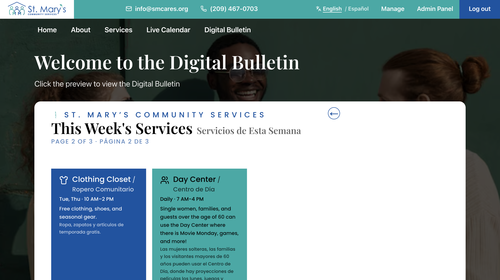
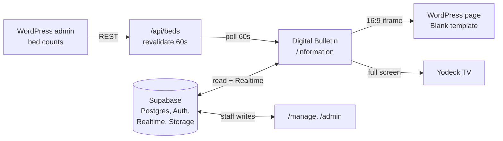

# SMCS Digital Bulletin



## What is this

A Next.js app for **Saint Mary's Community Services (SMCS)**, a nonprofit
shelter. Its main job is the **Digital Bulletin** at `/information`: a
full-screen, auto-rotating display on wall-mounted TVs around campus, showing
services, announcements, and live bed availability. Yodeck players point at
that route, and the SMCS WordPress site embeds the same route in an iframe.

The same app also serves the public website, a Live Calendar for TVs and
phones, personal schedules, and the staff tools that edit all of it.

## Get it running locally

```bash
git clone https://github.com/nickaustinn/SMSC-App-Digital-Schedule.git
cd SMSC-App-Digital-Schedule
npm ci
cp .env.example .env.local     # then fill in the 3 values, see Environment variables
npm run dev
```

Open <http://localhost:3000/information> for the bulletin itself, or
<http://localhost:3000> for the home page.

You need Node 22.x (nothing is pinned in `package.json`; Next.js 15 needs
18.18+), npm (the repo commits `package-lock.json`), and access to the SMCS
Supabase project. Without the Supabase values the app throws a clear error at
startup instead of half-working.

| Command | What it does |
| --- | --- |
| `npm run dev` | Dev server on port 3000 |
| `npm run lint` | ESLint (`next lint`, deprecated in Next 16) |
| `npm run build` | Production build. This is also the only type check. |
| `npm run start` | Serve an existing production build |

There is no test suite. Do not run `npm run build` while `npm run dev` is
running against the same `.next` directory.

## How it fits together

**Supabase is the single source of truth.** Bulletin content, custom slides,
events, user roles, and display settings all live there. The browser talks to
it directly with the public anon key; Row Level Security, not key secrecy, is
the authorization boundary.

**WordPress is a secondary source, for bed counts only.** Staff update bed
numbers in WordPress admin. This app reads them through one server-side API
route and never writes back.



> **TODO: verify.** A React Native mobile app reportedly shares this Supabase
> backend. No mobile code exists in this repo and nothing here references it.
> Confirm where it lives and which tables it shares before changing schema.

### The 1920x1080 canvas

Every bulletin slide is laid out on a **fixed 1920x1080 canvas**
(`src/lib/bulletinCanvas.ts`). `InformationDisplay` measures the box it was
handed (not the window) with a `ResizeObserver` and scales the whole canvas to
fit, letterboxing rather than cropping.

**This means: size against the canvas, never the viewport.** Use container
queries (`@min-[40rem]:`) instead of `sm:`/`lg:`, and `cqw`/`cqh` instead of
`vw`/`vh`. Inside an iframe the viewport is just the iframe's box, so a
viewport unit drops the embedded bulletin into a phone layout. That is the
exact bug the canvas exists to prevent.

### The WordPress embed

`/information` has no site chrome, never scrolls, and fills its box, so it
embeds as-is in a 16:9 iframe on a WordPress page using the **Blank template**.
`BulletinPreviewCard` does the same thing on the home page if you need a
reference.

```html
<div style="position:relative;width:100%;aspect-ratio:16/9;">
  <iframe src="https://<vercel-domain>/information?location=<slug>"
          style="position:absolute;inset:0;width:100%;height:100%;border:0;"
          scrolling="no" title="SMCS Digital Bulletin"></iframe>
</div>
```

> **TODO: verify.** Which WordPress page holds this iframe, and who has admin
> access. None of it is represented in this repo.

## Routes

| Route | What it is | Access |
| --- | --- | --- |
| `/information` | **Digital Bulletin.** Yodeck and iframe target. Takes `?location=<slug>`. | Public |
| `/dashboard` | Live Calendar, view-only week schedule for TVs and phones | Public |
| `/` | Home page: hero, live bulletin preview, bed availability popup | Public |
| `/manage` | Staff editor: events, bulletin content, slides, locations | employee, admin |
| `/admin` | User and role management | admin |
| `/schedule` | The signed-in user's personal schedule | Any signed-in user |
| `/login`, `/signup` | Auth. Sign-up is gated to `@smcares.org` addresses. | Public |
| `/api/beds` | Bed availability JSON, proxied from WordPress | Public |

Auth is layered: `src/middleware.ts` gates `/schedule`, `/manage`, `/admin`;
those pages re-check role server-side; **RLS in Postgres is the real
enforcement.** UI guards are convenience, never the boundary.

## Environment variables

All three are required. Copy `.env.example` to `.env.local` and fill it in.
Next.js reads env only at startup, so restart the dev server after editing.

| Variable | Purpose | Exposure | Where to get it |
| --- | --- | --- | --- |
| `NEXT_PUBLIC_SUPABASE_URL` | Supabase project URL, e.g. `https://your-ref.supabase.co` | Public, ships to browser | Supabase, Settings > API, "Project URL" |
| `NEXT_PUBLIC_SUPABASE_ANON_KEY` | Publishable/anon key for browser and server clients | Public, ships to browser | Supabase, Settings > API, "Publishable key" |
| `BED_DATA_URL` | WordPress REST endpoint returning live bed counts | **Server only**, read inside `/api/beds` | The SMCS WordPress site |

- The two public values are public on purpose. Access is restricted by RLS.
- **Never** put a `service_role` or secret key in a `NEXT_PUBLIC_` variable. It
  bypasses RLS and would ship to every browser.
- `DATABASE_URL` appears commented out in `.env.example` and is not read
  anywhere in the code today.

## Database

The web deploy and the database are separate. Apply `supabase/migrations/*.sql`
**in numeric order** through the Supabase SQL Editor.

- `0008` creates the public `slide-images` Storage bucket and its policies.
- `0011` is superseded by `0020`. Do not re-run `0011` afterward.
- Add changes as new, ordered, idempotent migrations. Never rewrite applied ones.

## Key features

### Bed availability, end to end

1. Staff update the count in **WordPress admin**, exposed at a REST endpoint.
2. **`GET /api/beds`** fetches `BED_DATA_URL` server-side and caches it for
   **60 seconds** (`revalidate = 60`).
3. **`useBedAvailability()`** polls `/api/beds` **every 60 seconds** from the
   browser.
4. **The panel renders**: `BedAvailabilitySlide` (red, top-right of the
   bulletin) and `BedAvailabilityPopup` (home page).

Two 60-second layers means a WordPress change lands in roughly 60 seconds, up
to about 2 minutes worst case.

Failure behavior is deliberate. A failed upstream fetch returns
`{ ok: false }` with HTTP 200, the client ignores it, and the last good numbers
stay on screen. If nothing has ever loaded, the panel renders nothing at all
rather than show a number it is unsure of. A program at `total: 0` shows a
"Full" badge, not a zero.

**Watch out:** the panel floats over the canvas, so every slide reserves space
for it via `BED_PANEL_CLEARANCE` in `BedAvailabilitySlide.tsx`. Change the
panel's size and you must re-measure and update that constant, or slides start
creeping underneath it.

### Slide rotation

Order: services pages (repeatable, auto-numbered) → new arrivals → demographic
→ events today → custom slides by `position`. Each page shows for
`PAGE_DURATION` (**30 seconds**, in `informationContent.ts`) with a 0.5s
cross-fade. Exactly one slide is mounted at a time.

Two filters apply on top:

- **Hidden built-ins**: staff can drop a built-in page from the rotation
  without losing its editor. Services, new arrivals, and events-today are
  protected.
- **Location targeting**: with `?location=<slug>`, a page or slide appears only
  if it targets that location or targets none at all (meaning "everywhere").

Everything is kept live by a Supabase Realtime subscription, so **a staff edit
reaches the TVs without anyone touching the TVs.**

### Management interface (`/manage`)

Staff with role `employee` or `admin` get three sections: the **calendar**
(create, drag, resize, delete events), **bulletin pages** (edit built-in copy
in English and Spanish, hide/restore, assign to locations), and **custom
slides** (four templates, three backgrounds, bilingual text, image upload to the
`slide-images` bucket, drag to reorder, location targeting). A fourth panel
manages **bulletin locations** and shows the exact Yodeck URL for each screen.

Deletes are recoverable. Hidden built-ins and soft-deleted slides appear under
"Recently deleted" with a Restore action.

## API routes

There is exactly one.

| Route | Method | Returns | Caching |
| --- | --- | --- | --- |
| `/api/beds` | `GET` | `{ ok: true, programs, reserve_phone, updated_at_display }` on success; `{ ok: false }` with **HTTP 200** on any upstream failure | `revalidate = 60` on the route and the fetch |

```json
{
  "ok": true,
  "programs": [
    { "key": "family", "label": "Family Shelter",
      "counts": { "male": { "label": "Male beds available", "count": 4 } },
      "total": 4 }
  ],
  "reserve_phone": "(209) 555-0123",
  "updated_at_display": "Updated 9:15 AM"
}
```

> **TODO: verify.** The shape above is reconstructed from the `BedData` type in
> `src/lib/useBedAvailability.ts`, not from a captured response. Confirm the
> real field names and program list against the WordPress endpoint.

Everything else goes browser-to-Supabase directly through `src/lib/*`.

## Deployment

Standard Next.js on Vercel. There is **no `vercel.json`** and no checked-in
Vercel config, so assume no custom regions, redirects, or build settings.

1. Import the repo into Vercel. Framework preset Next.js, install `npm ci`,
   build `npm run build`.
2. Add the three environment variables under Settings > Environment Variables,
   for Production **and** Preview.
3. Deploy, then smoke-test `/`, `/information`, `/dashboard`, `/manage`, and
   `/api/beds`.

### Production handoff checklist

- [ ] Three env vars set in Vercel (Production and Preview).
- [ ] Migrations `0001` to `0020` applied; `slide-images` bucket exists and is public.
- [ ] Supabase Auth site URL and redirect URLs point at the Vercel domain.
- [ ] At least one `admin` profile exists. The first one must be promoted directly in Supabase.
- [ ] **WordPress iframe `src` updated** to the Vercel URL, with the right `?location=` slug.
- [ ] **Framing headers configured** (see below).
- [ ] Yodeck players pointed at the production URLs.
- [ ] Bulletin checked at 1920x1080 on a real TV, not just a desktop browser.

**Framing headers.** Next.js sends no `X-Frame-Options` by default, so framing
works today but is unrestricted. To allow only the SMCS WordPress domain, add
to `next.config.ts`:

```ts
async headers() {
  return [{
    source: "/information",
    headers: [{
      key: "Content-Security-Policy",
      value: "frame-ancestors 'self' https://smcares.org https://www.smcares.org",
    }],
  }];
}
```

Prefer CSP `frame-ancestors` over `X-Frame-Options`; the latter has no
multi-origin form, and `SAMEORIGIN` would break the embed outright.

> **TODO: verify.** Confirm the exact production WordPress origins (apex vs
> `www`, http vs https) before adding this. A wrong value silently blanks the
> embed.

## Yodeck setup

Each TV runs a Yodeck **Web Page** item pointed at:

```
https://<vercel-domain>/information?location=<slug>
```

- Full screen, 1920x1080, no scrollbars, scheduled refresh **off**. The page
  rotates and refreshes its own data indefinitely.
- No `?location=` means the screen shows everything, global and targeted alike.
- `/manage` shows the copyable URL per location and is the authoritative list.

Slugs seeded by migration `0017`, with renames in `0018` and `0019`:

| Location | Slug |
| --- | --- |
| Family Shelter Cafeteria | `family-shelter-cafeteria` |
| Zeider Housing Lobby | `zeider-housing-lobby` |
| Dining Room | `dining-room` |
| Mens Hygiene | `mens-hygiene` |
| Womens Hygiene | `womens-hygiene` |
| Dentist Building | `dentist-building` |

Renaming a location changes its slug and therefore its URL. Whoever renames it
must re-point that screen in Yodeck.

## Troubleshooting

| Symptom | Fix |
| --- | --- |
| Bed counts stale | Open `/api/beds`. If `{ ok: false }`, the upstream fetch failed: check `BED_DATA_URL` in Vercel and that WordPress responds. Otherwise wait ~2 min for both 60s layers. |
| Bed panel missing entirely | `programs` was absent from the response, so the panel renders nothing rather than an uncertain number. Check the upstream payload. |
| Bed panel covers slide text | The panel size changed. Re-measure it and update `BED_PANEL_CLEARANCE` in `BedAvailabilitySlide.tsx`. |
| Bulletin looks like a phone layout in the iframe | A slide is keying off the viewport. Replace `vw`/`vh` and `sm:`/`md:`/`lg:` with `cqw`/`cqh` and container queries. |
| Iframe blank, "Refused to display in a frame" | `frame-ancestors` or `X-Frame-Options` excludes the WordPress origin. Fix the header in `next.config.ts`. |
| Iframe renders but collapsed | The container needs a real height. Use a `16/9` aspect-ratio box, not `height: auto`. |
| Colored bars around the bulletin | Expected. `fitScale` contains rather than crops. Make the container 16:9 or accept the letterbox. |
| Slides flash full-size on load | Something renders the canvas outside `InformationDisplay`'s scaling wrapper. Scale starts at 0 until measured. |
| Staff edit not reaching the TVs | Check the table is in the Realtime publication, the slide is not hidden, not targeted away from that screen, and (for services pages) not empty. |
| Sign-up rejected | Only `@smcares.org` can register, enforced by a DB trigger. New accounts have no edit access until an admin grants a role. |
| "Missing Supabase env vars" at startup | `.env.local` missing or edited without restarting the dev server. |
| Times off by a timezone | Intentional. Calendars use UTC as a fixed wall clock (`timeZone="UTC"`). Do not add local-time conversion without a data migration plan. |

## Constraints

**Free-tier infrastructure only. This is a hard cost constraint.** SMCS is a
nonprofit running on Vercel Hobby and Supabase free. No paid services, no
add-ons, no usage patterns that blow past free-tier limits. The 60-second bed
cache exists partly for this reason.

**WCAG AA contrast is required.** The audience is older and often in distress.
Base font is 18px with generous line height, focus styles stay visible, and
clickable things show a pointer cursor.

**Do not change the palette without explicit instruction.** Teal `#00aaa6` and
blue `#0054a4` are the only accents, on white with black text; `#d4d4d4` is the
placeholder gray. The bed panel's red `#c1121f` is the one deliberate
exception, for live status. Use the Tailwind tokens (`blue`, `teal`, `ink`,
`paper`, `placeholder`), not raw hex.

**Static, minimal motion by design.** A 0.5s cross-fade and gentle staggered
rise-ins, nothing more. No flashing, no fast movement, no attention-grabbing
animation.

**Code conventions** (full list in `AGENTS.md`): Server Components by default;
`"use client"` only for browser state, effects, or interactive third-party UI.
`@/` imports. Data access lives in `src/lib`, not inline in pages. Realtime
subscriptions always paired with cleanup.

## Project structure

```
messages/en.json, es.json          UI strings (next-intl, cookie-based locale)
supabase/migrations/               Ordered SQL. Source of truth for the schema.
next.config.ts                     Wires the next-intl plugin. No custom headers yet.
AGENTS.md                          Conventions and working rules

src/middleware.ts                  Auth gate for /schedule, /manage, /admin
src/i18n/                          Locale resolution and message loading

src/app/
  layout.tsx                       Root: html/body, globals.css, intl provider
  globals.css                      Tailwind, design tokens, a11y base, calendar theming
  (site)/                          Route group WITH header/nav/footer
    page.tsx                       Home: hero, bulletin preview iframe, bed popup
    manage/, schedule/, login/, signup/
  information/page.tsx             DIGITAL BULLETIN. Full screen, reads ?location=
  dashboard/page.tsx               Live Calendar wall display
  admin/page.tsx                   User and role manager
  api/beds/route.ts                The only API route

src/components/
  information/
    InformationDisplay.tsx         Rotation controller + canvas scaling. The core.
    InfoPageShell.tsx              Shared slide frame
    ServicesOverviewPage.tsx       "This Week's Services", repeatable and numbered
    NewArrivalsPage.tsx, DemographicPage.tsx, EventsTodayPage.tsx
    CustomSlidePage.tsx            Renders a staff-authored slide
    SlideTemplateView.tsx          The four slide templates
    motion.ts                      Framer Motion variants
  manage/                          Staff editors: slides, content, events, locations
  admin/, dashboard/, calendar/, schedule/, auth/
  BedAvailabilitySlide.tsx         Red bed panel on the bulletin
  BedAvailabilityPopup.tsx         Taller bed panel for the home page
  BulletinPreviewCard.tsx          Home-page 16:9 iframe of /information

src/lib/
  bulletinCanvas.ts                CANVAS_WIDTH/HEIGHT, fitScale(). Read before slide work.
  slides.ts                        Custom-slide types, CRUD, ordering, image upload
  infoContent.ts                   Editable bulletin content (Supabase)
  informationContent.ts            Fallback copy + PAGE_DURATION
  displaySettings.ts               Which built-ins are hidden
  bulletinLocations.ts             Locations and targeting
  useBedAvailability.ts            Polls /api/beds. Shared by both bed panels.
  events.ts, manageEvents.ts, useLiveEvents.ts
  supabase.ts                      Browser client
  supabase-server.ts               Server client for RSC and route handlers
  adminUsers.ts, staffSignup.ts, dashboardConfig.ts, siteConfig.ts
  README.md                        Guide to this folder
```

## Known unfinished work

- **QR code: not implemented, and hidden on the Live Calendar.** The plan is a
  QR in the top-right of `/dashboard` for people to open the schedule on their
  phone. Only the empty `QrPlaceholder` slot was built, so it is gated behind
  `SHOW_QR_PLACEHOLDER` in `dashboardConfig.ts`, set to `false`. To finish:
  generate a real code and flip the flag.
- **Info bar and contact details are code-edited, not staff-editable.**
  `INFO_BAR_ITEMS` (`dashboardConfig.ts`) and `siteConfig.ts` hold the real SMCS
  phone and email, duplicated across both files, so a change means editing both.
- `informationContent.ts` is fallback copy. Staff overrides saved in Supabase
  take precedence.
- Client self-registration and a staff path for assigning personal `signups`
  are not implemented. The DB trigger allows only the staff email domain.

> **TODO: verify.** This repo is the whole SMCS site, not a bulletin-only
> project. Confirm whether the bulletin is meant to split into its own
> deployment or stay one app.
